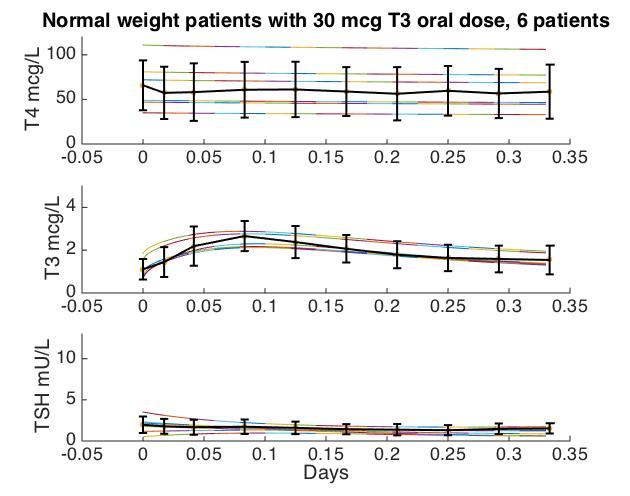
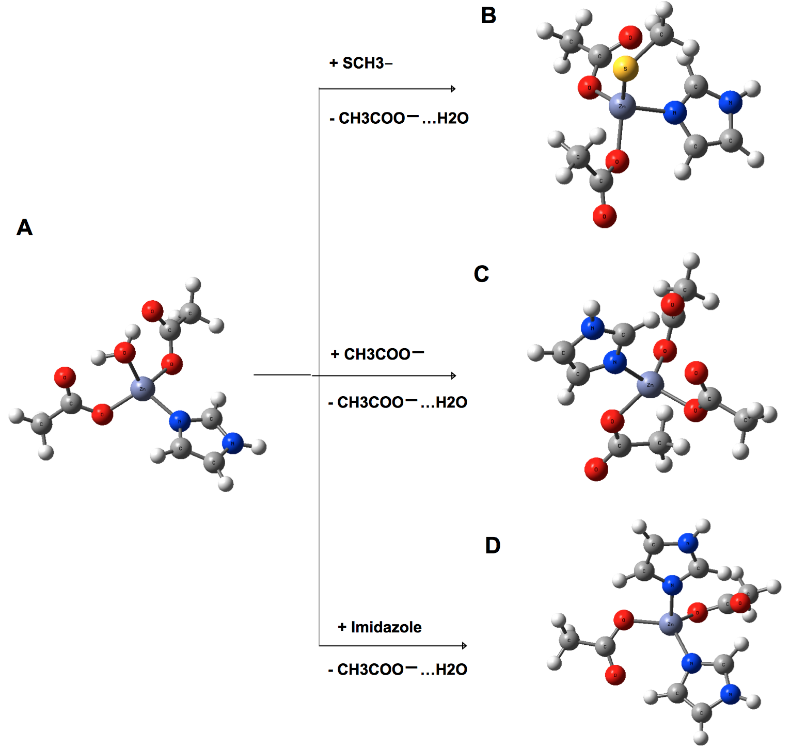

### About me 
I am a Ph.D student in the [biomathematics program](http://www.biomath.ucla.edu/) at UCLA, advised by Kenneth Lange and Janet Sinsheimer. I am interested in applying mathematics and statistics to study complex biological problems, particularly those arising in genetics and the health sciences. As such, my interest and/or expertise broadly includes:

1. Optimization and computing
1. Statistical and mathematical methods for human genetics
1. System wide biology modeling

### Open Mendel team at UCLA (2017 - )

### Biocybernetics at UCLA (2016 - 2017)
For almost 2 years I worked for [Joseph Distefano III](https://www.cs.ucla.edu/joseph-distefano-iii/) to upgrade the thyroid system simulator [THYROSIM](http://biocyb1.cs.ucla.edu/thyrosim/) (which have not been updated yet! sorry!) so that the model automatically adjusts its predictions based on different patient parameters. 

**Short intro**: In the medical field, patients often have impaired or completely removed thyroid due to various illnesses. These patients therefore cannot produce hormones Thyroxine (T4) and Triiodothyronine (T3) sufficiently, so doctors give them artificial supplements. The problem is, the body excretes these drugs very fast, but patients need these hormones to be maintained at a minimal level around the clock. So our model must be able to account for different body parameters such as sex and obesity level while accurately predicting the level of T3, T4, and TSH (yet another important hormone) given a T3 or T4 supplement that we can potentially administer whenever we want. 

.

### Computational biology at Academia Sinica (2013 - 2016)
I previously worked for professor [Carmay Lim](http://www.ibms.sinica.edu.tw/pi_webpage/blue_style2016/index.php?p_id=34&journal_info_sysid=100612) at the institute of biomedical sciences, Academia Sinica, as an undergraduate research assistant. 

**Short intro:** Metal cofactor are often drug targets for many kinds of diseases. My project focused on computing and optimizing for the binding affinities of a variety of real and simulated drug models, particularly those incovling the zinc ion. For instance, the following molecules simulate the interaction of [HDAC](https://en.wikipedia.org/wiki/Histone_deacetylase) with 3 potential drug compounds:

.

