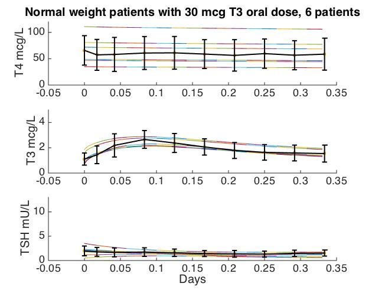
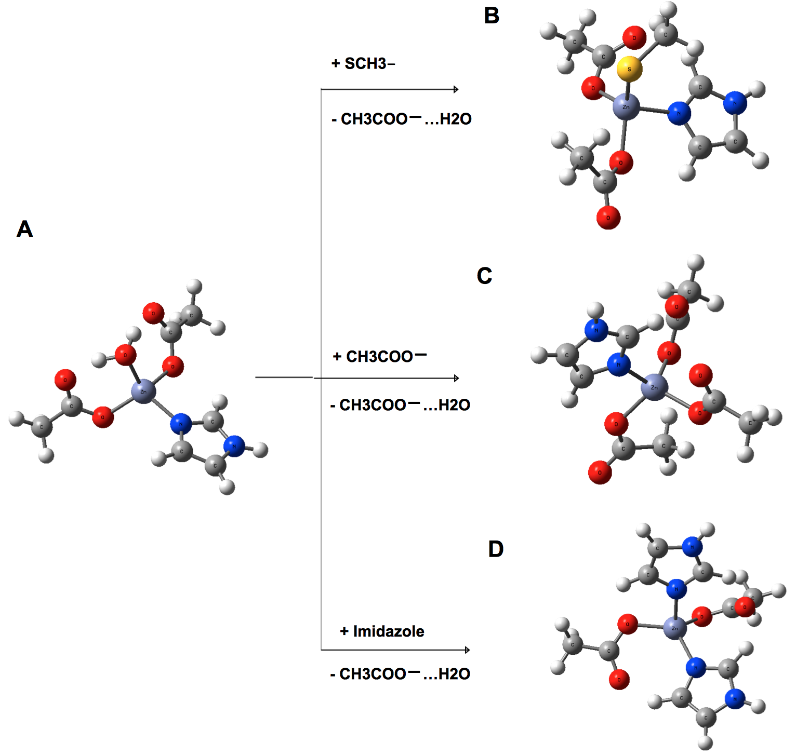

## About me 

I am currently a Ph.D student in the [biomathematics program](http://www.biomath.ucla.edu/) at UCLA, advised by Kenneth Lange and Janet Sinsheimer. I am interested in applying mathematics and statistics to study complex biological problems, particularly those arising in genetics and the health sciences. As such, my interests broadly includes:

1. Optimization and computing
1. Statistical and mathematical methods for human genetics
1. System wide biology modeling

## Open Mendel team at UCLA (2017 - )

**Short intro**: Recent advances in molecular biotechnologies have produced **big** datasets that requires fast and memory efficient algorithms to analyze them effectively. Unfortunately, modern genetic analysis softwares are very hetergeneous in terms of data handling, hindering reproducibility that science fundamentally depends upon, while users waste inordinate amounts of time on menial tasks like data pre-processing. The [Open Mendel](https://openmendel.github.io/) umbrella program is attempting to streamline genetic research by providing a centralized analysis environment. I am responsible for the implementation of Iterative Hard Thresholding, which you can read more about in my [blog posts](https://biona001.github.io/year-archive/). Notably, all packages under Open Mendel are written in the nascent but extremely well designed language [Julia](https://julialang.org/). 

   

## Biocybernetics at UCLA (2016 - 2017)

For almost 2 years I worked for Professor [Joseph Distefano III](https://www.cs.ucla.edu/joseph-distefano-iii/) to upgrade the thyroid system simulator [THYROSIM](http://biocyb1.cs.ucla.edu/thyrosim/) (which have not been updated yet! sorry!) so that it automatically adjusts predictions based on different patient parameters. 

**Short intro**: In the medical field, patients often have impaired or completely removed thyroid due to various illnesses. These patients therefore cannot produce hormones Thyroxine (T4) and Triiodothyronine (T3) sufficiently, so doctors give them artificial supplements. However, the body excretes these drugs very fast, and patients need these hormones to be maintained at a minimal level around the clock. *So how much drug, and at what interval, should we administer hormone supplements? What resulting hormonal level should we expect?* Our model must be able to account for different body parameters such as sex and obesity level while accurately predicting the level of T3, T4, and TSH (yet another important hormone!) given a treatment plan involving T3 or T4 (or both) supplements.

  

## Computational biology lab at Academia Sinica (2013 - 2016)

For 3 summers I worked for Professor [Carmay Lim](http://www.ibms.sinica.edu.tw/pi_webpage/blue_style2016/index.php?p_id=34&journal_info_sysid=100612) to compute the binding affinities of various drug molecules with zinc. I owe many to my two mentors Leon and Cedric, but I cannot find you guys online, sorry. 

**Short intro:** Metal cofactors often play crucial roles in various enzymatic reactions. Many diseases have an over-expression of such reactions, so the logic goes that if we can prevent these catalytic reactions, we cure the disease. One way to prevent these reactions is to competitively bind the metal ions with inhibitors, rendering the ion non-active. *How should we design such inhibitors?* My project focused on the structural optimization of various drug models, particularly those incovling the zinc ion, and also on the computation the binding affinities of these model for a specific zinc site. For instance, the following reaction simulate the interaction of [HDAC](https://en.wikipedia.org/wiki/Histone_deacetylase) with 3 hypothetical drug compounds:

  

