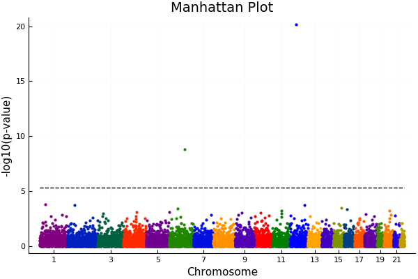
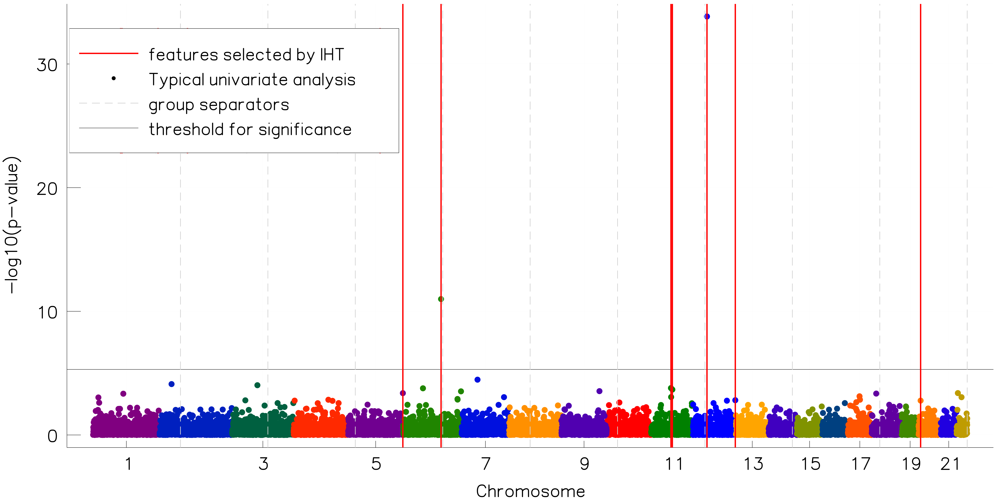
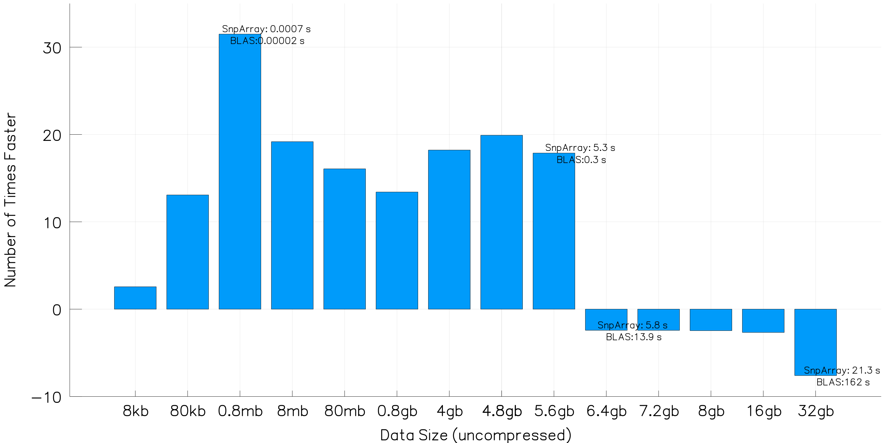

Hi everyone, this is the final (summarizing) blog post for my Google Summer of Code project.

## Problem Motivation

DNA testing is cheap, effective, and abundant. Anyone can just do it at specialized centers with a modest cost of [$\sim 200$ USD](http://www.cidr.jhmi.edu/services/pricing.pdf). Sometimes this may reveal the genetic basis for ongoing illnesses. Other times testing discover diseases that have a late-onset age, contributing to personalized medicine. How do scientists know what region of the genome contribute to a disease? We obtain this knowledge from [Genome Wide Association Studies](https://en.wikipedia.org/wiki/Genome-wide_association_study) (GWAS). Analysis of GWAS datasets is what this project is about. 

#### Problem: traditional (p-value) analysis are not effective



A traditional GWAS analysis would result in a graph looking like the above (generated by [MendelGWAS.jl](https://openmendel.github.io/MendelGWAS.jl/) package).

Each colored dot represents a p-value for a *single nucleotide polymorphism* (SNP), and the dotted black lines represents the *threshold* for statistical significance. The p-value must pass this threshold for scientists to conclude a SNP is affecting the trait under consideration. Due to the problem of multiple testing, the more SNPs tested in a given experiment, the higher this threshold, and hence, this method admits a lot of [false negatives](https://en.wikipedia.org/wiki/False_positives_and_false_negatives). Those that don't breach the threshold are effectively deemed **not significant** unless followed up by further studies. Enforcing such a threshold is not good science, because in the real world there is no such "cutoff".

Therefore, we want a more **effective** way to interpret GWAS results. Since GWAS datasets can be **huge** (> 500,000 people and >8 million SNPs resulting in >100 GB datasets), this new method must also be extremely **scalable**. As one may guess, there is a trade-off between speed and quality of analysis, and balancing this is quite a challenge algorithmically. 

#### Solution: Replace (single-variate) p-value analysis with iterative hard-thresholding (IHT)

We think the relatively novel algorithm iterative hard-thresholding (IHT) is the most suited for this job. It is one of the most scalable algorithms for subset selection, has great convergence guarantees, is better than LASSO \& MCP for model selection (i.e. producing good quality models), simple to implement, and has low memory-footprint as desired in modern big-data analysis. We pushed through with this idea and implemented IHT in Julia. This post summarizes a few extra features that we added over this summer. 

Note: The mathematics of IHT and how it is applied in genetics is explained in [this paper](https://onlinelibrary.wiley.com/doi/abs/10.1002/gepi.22068)

## Example Input/Output and usage:

To run the new functions in `IHT.jl`, execute the following in the Julia REPL:

```
using IHT
MendelIHT("gwas 1 Control.txt")
```

#### Preparing Input files

In Open Mendel, all analysis parameters are specified via the `Control.txt` file. An example of a control file looks like the following:

```
#
# Input and Output files.
#
plink_input_basename = gwas 1 data
output_file = gwas 1 Output.txt
#
# Analysis parameters for IHT option.
#
data_type = genetic
predictors_per_group = 2
max_groups = 4
group_membership = 10_group_gwas1.dat
```

Note the genotype file **must** be stored in the [PLINK binary format](http://zzz.bwh.harvard.edu/plink/binary.shtml). 

1. **plink_input_basename:** This is your PLINK compressed genetics data. All 3 files `.bim`, `.bed`, `.fam` must be present.
2. **output_file**: Stores the `IHTResult` term as seen in the previous section.
3. **data_type:** Currently only accepts `data_type = genetic`. This is preparing for future analysis on non-genetic data.
4. **predictors_per_group:** Maximum number of active groups specified by user.
5. **max_groups:** Maximum number of predictors per group, specified by user.
6. **group_membership:** A text file indicating group membership, where there is the same number of lines equal to number of SNPs plus 1 (since the intercept needs a group-membership as well). Each line must be a positive integer. Currently all predictors (and the intercept) must belong to exactly 1 group. 

Example files of each can be found [here.](https://github.com/klkeys/IHT.jl/tree/master/test)

#### Sample output on "gwas 1 data":

```
IHT results:

Compute time (sec):     2.060492161
Final loss:             1130.1137206545498
Iterations:             11
Max number of groups:   4
Max predictors/group:   2
IHT estimated 8 nonzero coefficients.
8*3 DataFrames.DataFrame
| Row | Group | Predictor | Estimated_b |
|-----|-------|-----------|-------------|
| 1   | 4     | 3544      | -0.0756442  |
| 2   | 4     | 3981      | 0.144222    |
| 3   | 7     | 6611      | 0.0833481   |
| 4   | 7     | 6627      | -0.0739322  |
| 5   | 8     | 7023      | 0.27132     |
| 6   | 8     | 7347      | -0.0660806  |
| 7   | 10    | 9467      | -0.0798     |
| 8   | 10    | 10001     | 0.140569    |
```

#### Superimposing these predictors onto the previous Manhattan plot, we would get:



#### Explanation for Output

In the previous example, we told IHT that a maximum of 4 groups can be selected, and each group can have at most 2 predictors. The groups were (naively) organized into ten consecutive SNP blocks of size 1000. Here's a run-down of what each field means:

1. **Compute time:** The time it took the *computation* to finish (so this excludes reading in the data, constructing the data types...etc)
2. **Final loss:** The residual after IHT converges.
3. **Iterations:** Number of gradient steps needed for IHT to converge.
4. **Max number of groups:** Maximum number of groups specified by user.
5. **Max predictors/group:** Maximum number of predictors per group, specified by user.
6. **DataFrames.DataFrame table:** The selected predictors, the groups they belong, and the estimated cofficient for approximating the solution. The last predictor (10001 in this case) represents the intercept. 

Note interestingly, predictors **are not** selected based on their p-value, although a higher p-value is correlated with being selected. This effect is observed in block 4 (between chromosome 5 and 7) where a purple SNP was selected even though a green SNP had a higher p-value. I find many people asking why is this, so I should clarify: IHT is an algorithm for *multi-variate* analysis, where many SNPs come into the model and affect each other. It is completely different from the traditional *single-variate* p-value analysis where we consider one SNP at a time. Thus, having a slightly higher p-value does not imply the predictor is a better candidate when other predictors have their effects come into play. 

#### What does grouping mean? why did we do that? 

**tl;dr** Maintaining group structures should increase prediction power.

A genetic phenomenon called linkage disequilibrium occurs as a result of the inheritance mechanisms for chromosomes. It ensures that SNPs (predictors) are inherited in large correlated blocks. In the presence of such collinearity, 2 highly correlated SNPs might amplify each other's effect, and both enter the model as a consequence. This is not desired, because:

1. The individual effect of these SNP on the trait is over-estimated.
2. Knowing both does not add to existing information, because the presence/absence of one will completley inform us about the other.

By *grouping* these predictors into the same group, and forcing each group to pick only the top $k$ predictors, we can reduce the *second* undesired effect. Since a modern GWAS can contain millions of SNPs, often sparsity is desired on the group level (few number of active groups) as well as on the single predictor level (few predictors per group). We do so by projection onto a double-sparsity set $P_{S_{J, k}}$ where we simultaneously limit the number of active groups $J$ and the number of active predictors per group $k$. 

Below I humbly summarize my main contributions this summer by organizing them into 3 milestones. 

### Milestone 1: Integration of IHT.jl with Open Mendel

Previously `IHT.jl` required `PLINK.jl` and `RegressionTools.jl` to run. These 2 other packages provided routines to read/write genetic data and functions for doing statistical analysis. While `PLINK.jl` and `RegressionTools.jl` have their pros and cons, they have not been widely adopted by the Julia genetics community. Therefore, I built a new backend routine for `IHT.jl` that is based on the Open Mendel ecosystem - a statistical genetics software in Julia that provides a uniform platform for 11 other genetic analysis options. By integrating with Open Mendel, we unify data handling with other genetic packages, streamlining data processing and compatibility. Obviously this comes with a list of pros and cons, listed below:

#### Advantages:

1. **Other genetic analyses are seconds away.** Since all Open Mendel analyses have the same backend data handling, preparing 1 input file to run IHT instantly gives you access to 11 more genetics analyses. Lots of common utilities needed in genetics such as simulation, fitting variance components model, linkage analysis...etc. can be done under the same hood. This saves user tremendous time from chaining numerous software packages for 1 analysis pipeline.

2. **Compact storage of large genotype files.** IHT interfaces with `SnpArrays.jl` to perform linear algebra directly on raw genotype data. Therefore, we never have to expand this matrix to a double-precision matrix, reducing the memory footprint by 32 times. 

3. **Faster linear algebra than BLAS for large matrix.** The speed comparison of SnpArray's linear algebra with BLAS is shown in figure below. For large enough matrices, SnpArrays is faster because they avoid file swapping with the hard disk.



#### Disadvantages:

1. **Lost of existing functionalities.** The original IHT can perform cross-validation, GPU acceleration, and run on numeric data. To re-enable these (very desirable) features with Open Mendel as back-end, we need to put in a lot of extra work. 

2. **Sub-par memory footprint.** On a dataset of size 5.5 mb, the current IHT optimization runs with 15.65 MB while the old IHT runs in 5.37 mb. That is, the new IHT backend consumes roughly 3 times the memory compared to its original backend. Thus we need to spend a lot of extra effort for optimization. The speed for both is roughly the same. 

### Milestone 2: Doubly Sparse Group Projection

Grouping is a fairly intuitive cencept that is rather straightforward to implement, and many mathematicians have discussed and/or implemented it in various forms. Our main novel contribution comes from enforcing 2 levels of sparsity in iterative hard-thresholding, on the group level and within group level. Details for why we did so was explained in a separate section above. 

Note that grouping is not a novel idea. It have been done in other subset regression methods such as LASSO, as well as in IHT. However, to our knowledge, no existing variants of the IHT algorithm implement a **doubly sparse projection** as we have, and nobody applied IHT in genetics or more broadly in the field of bioinformatics. 

### Milestone 3: Weighting Predictors


This summer my research group admitted 2 undergraduates as part of the [B.I.G Summer program](https://qcb.ucla.edu/big-summer/). I collaborated with them to design a pipeline for weighting each individual SNPs. 

The motivation behind weighting stems from biology. In the real world, deleterious SNPs are often quite rare because bad mutations should theoretically be eliminated by natural selection. As a consequence, these rare "signals" could be lost as noise. In order to better detect these signals, we can up-weight these SNPs using some information known beforehand, such as their frequency. If a rarer SNP is assigned a higher weight, then it is less likely that we treat it as noise, because we explicitly tell IHT to give more consideration to these SNPs. 

Currently, we successfully incorporated the frequency-based method of weighting predictors by turning the least squares criterion in IHT into a weighted least squares criteria. Now we are investigating less naive methods for weighting predictors, such as a gene candidate approach or pathway-based approach. These 2 methods take real biological insights into account when assigning weights, and thus, our model should more accurately reflect reality. However, designing a pipeline to query an (online) database for millions of SNPs is quite a software engineering challenge. 

## Future work

Once again, I thank Julia computing for sponsoring my trip to JuliaCon 2018. 


I talked to many people, and brought home many ideas for improvements. Other than updating all code to Julia v1.0 ([cheers!](https://www.youtube.com/watch?v=1jN5wKvN-Uk&list=PLP8iPy9hna6Qsq5_-zrg0NTwqDSDYtfQB)), there are a few potential paths:

$\textbf{Optimizing existing code route}$: 

1. Redo matrix normalizing computation using `StandardizeMatrices.jl`
2. Fix memory-leak caused by intercept.
3. Profile `project_group_sparse` code: first replace `sortperm` with something more efficient, and change the whole function to operate in-place.
4. Change `b` and `b0` to type `SparseVector`.
5. Change `X_kb_k` to double precision matrix-vector multiplication.
6. Include fixed-effects in the model. 
7. Fix code for cross-validation. 

$\textbf{Multithread/GPU/Cloud computing route}$:

1. Make SnpArray/dense-vector multiplication multi-threaded. 
2. Look into GPU computing by starting with `GPUArrays.jl`. Enable SnpArray/dense-vector multiplication on the GPU. 
3. Break up IHT into a 2-step algorithm: first estimate `b` with half-precision, then refine calculation with double-precision, since the GPU is >100 times faster on half precision than double precision. 
4. Try techila technology: a cloud computing technology that hosts 400CPU cores. If we have access to cloud computing at cheap cost, these is little motivation to enable GPU computing. 

$\textbf{Theoretical route}$:

1. Provide convergence criterion of IHT with a doubly sparse projection.
2. Investigate (theoretically and empirically) whether it's possible to change the gradient step of IHT to a stochastic gradient step. This would save a lot of memory since the gradient step currently requires reading the whole genotype matrix into memory, whereas the stochastic version would just require reading in 1 row. 
3. Add a debiasing step in IHT. 
4. Prove convergence of IHT when predictors are weighted in some way. 
5. Understand fast proximal gradient method, in particular Nesterov acceleration.
6. Begin looking into logistic regression.

$\textbf{Less important things on the side:}$:

1. Figure out how to use `@code_native`, `@code_llvm`, `@code_typed`, `@code_lowered` macros to gain compiler efficiency
2. How to make custom arrays fast: macros like `@boundscheck` and `Meta.@lower`. Matt Bauman had numerous tricks on how to create a matrix of 1s and not allocate memory. This allows initialization of constant matrix/vector with no memory, which is good for GPU computing.
3. Use `Revise.jl` to avoid restarting julia and reloading the package upon a change - improving work flow.
4. Use `Rebugger.jl` to step into code - improve debugging. 
5. Try `promote()` on SnpArrays and dense vector multiplication
6. Package `Dagger.jl` calls `delayed()` to transform matrix/matrix multiplication to smaller chunks of work = multi-processing processing block chucks. This could potentially turn our BLAS level-2 operation into BLAS level-3, even though we're not calling BLAS. 
7. `ApproxFun.jl` also wrote their own linear algebra functions to make `BigFloat` work. Check how did they it and what is their speed. 
8. use `LineSearches.jl` in JuliaNLSolvers to do backtracking.
9. `GSReg.jl` is another subset regression package, which is possibly worth checking out. 
10. Niccolo antonello and lorenzo stella  are 2 students that implement proximal gradient algorithms in julia. They have packages like `StructuredOptimization.jl`, `ProximalOperators.jl`, `AbstractOperators.jl`, `ProximalAlgorithm.jl`.
11. `BioJulia` and `EcoJulia` does some neat things.
12. `BEDFiles.jl` is worth checking out and we can compare it's performance with `SnpArrays.jl`. 
13. Learn the concept of MapReduce since it's apparently super important
14. Look into tutorial on `addprocs()` at github.julia-computing/db
15. How to use complex step method to obtain super highly precise approximations in floating point arithmetic? See squire \& trapp 1998. 
16. Computer storage concepts behind unboxing and how to exploit it
